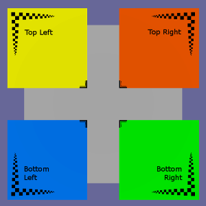

# PostIt interativo CIASC

## Screenshot



## Descrição

Este modelo demonstra a orientação das coordenadas de textura. Os materiais e acessórios foram todos nomeados de acordo com a função. Em particular, o acessador chamado "TopLeft_TEXCOORD_0" mostra que a parte superior esquerda da imagem de textura é representada por coordenadas de textura que variam de "0.0" a aproximadamente "0.4".

```
{
    "name": "TopLeft_TEXCOORD_0",
    "bufferView" : 7,
    "componentType" : 5126,
    "count" : 4,
    "max" : [
        0.3999999463558197,
        0.3999999761581421
    ],
    "min" : [
        7.915305388905836e-08,
        0.0
    ],
    "type" : "VEC2"
},
```

